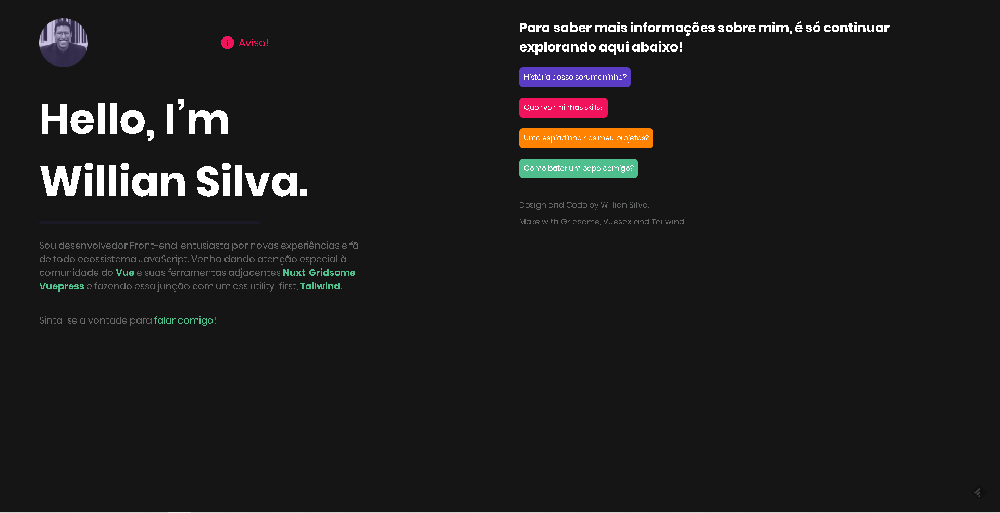

<h1 align="center">Gridsome - Portifólio Willian Silva</h1>

# Quem eu sou?

Olá, meu nome é Willian Silva! Sou desenvolvedor Front-end, entusiasta por novas experiências e fã de todo ecossistema JavaScript. Venho dando atenção especial à comunidade do Vue e suas ferramentas adjacentes Nuxt, Gridsome, Vuepress e fazendo essa junção com um css utility-first, Tailwind.

# Features

Esta aplicação possui todas as ferramentas e práticas mais recentes em desenvolvimento web!

- **Vue.js** — The Progressive JavaScript Framework
- **Vuesax** — Vuesax Frontend Vue Components
- **Gridsome** — Modern Site Generator for Vue.js
- **Tailwind** — A utility-first CSS framework for
rapidly building custom designs.

 
Made by Willian Silva

